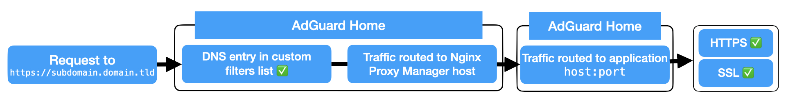
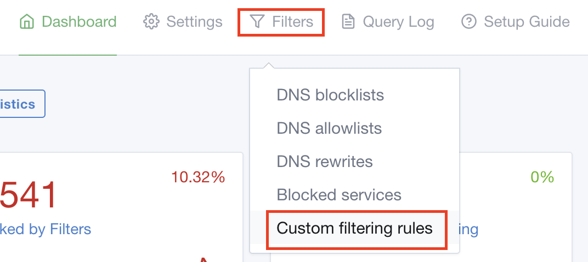
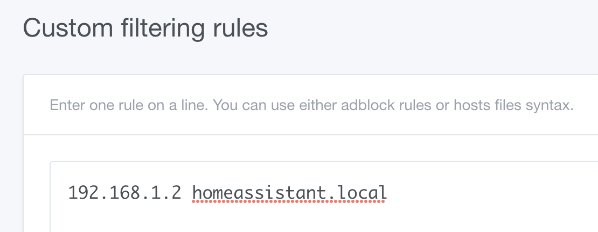

## Overview

Back when I bought my second Ubiquiti product, [(the UniFi Security Gateway, or USG 3)](https://store.ui.com/products/unifi-security-gateway) I started utilising the built in VPN server.  Since then I've moved to the Dream Machine Pro and tested out TailScale, but I still keep coming back to this rock solid VPN server.

Since this worked so well, I made the decision not to open up any of my self-hosted services to be directly internet facing.  I really wanted easy to understand sub-domains for my self hosted services, so I didn't have to go about remembering what host IP and port things ran on or try to explain that to family members!

I landed on a solution I came up with using NGINX Proxy Manager, Adguard Home and LetsEncrypt.  It isn't the most elegant, and I'm sure many people would be able to point out flaws or ways it could be improved, but it works.

## Diagram

## So what's happening here?

Say your domain is `mydomain.com`.  Let's say you setup [NextCloud](https://nextcloud.com) and you want it's web UI to be available at `nextcloud.mydomain.com`.

With this setup, when you access `nextcloud.mydomain.com` on your device, it will check for the DNS entry with your AdGuard Home instance.  Since AdGuard has a record for it, traffic is passed to Nginx Proxy Manager.

Nginx Proxy Manager has an entry for the sub-domain, which uses a (*wildcard) SSL certificate created through Let's Encrypt.  Traffic is then directed to the IP address and port of the self-hosted app you have setup.

## Replicating this setup

You will need:
- A domain name i.e. _yourname.com_ or similar
- A machine to run AdGuard Home and NGINX Proxy Manager (a Raspberry Pi is more than capable!)

## AdGuard Home

### Installing

I currently have my AdGuard instance installed as a [Home-Assistant add-on](https://community.home-assistant.io/t/home-assistant-community-add-on-adguard-home/90684).  You could also install it as a [Docker container](https://hub.docker.com/r/adguard/adguardhome).

### Point your DNS to AdGuard Home

Now that you have AdGuard up and running, make sure you point your DNS requests to it.  You can do this on a client-by-client basis by changing your network settings, or you should be able to do this for your whole network in your router settings (probably under something related to DHCP?)

### Setting up custom filtering

Once it's up and running, open up the AdGuard Home interface and click on "Filters" then "Custom filtering rules".

Once here you will need to make an entry for every sub-domain, with the IP address of your Nginx Proxy Manager box first.  e.g:

## Ngninx Proxy Manager

### Installing

I have Nginx Proxy Manager installed as a [Home-Assistant add-on](https://community.home-assistant.io/t/home-assistant-community-add-on-nginx-proxy-manager/111830).  You could also install it as a [Docker container](https://hub.docker.com/r/jc21/nginx-proxy-manager).

### Setting up a Proxy Host

- From the dashboard, click "Hosts" then "Proxy Hosts".
- Click "Add Proxy Host"