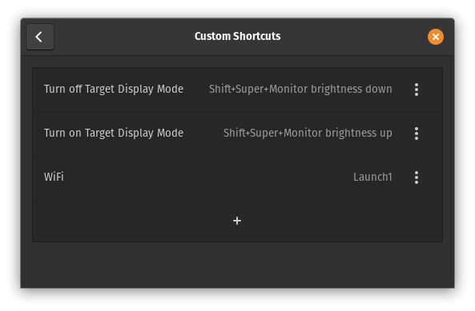
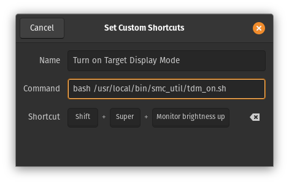

## Overview

In building our shed/home office, I was looking for a both a Linux machine that I could keep down there as well as a display to use with my iPad Pro or work MacBook Pro.

My Dad had an old (2011) 27" iMac laying around not doing much.  It's got an i5 CPU, 32GB RAM an SSD and a 2TB spinning rust drive inside.  The great thing about this machine is that it can do [Target Display Mode](https://support.apple.com/en-us/HT204592) via the included Mini Display Port.

Under it's regular operating system, (macOS) this means you can plug in a cable from the Mini Display Port on the back to another device such as a laptop or tablet, then press a keyboard shortcut and the iMac display becomes an external monitor for the device.

However as far as I knew, this was a feature only available in macOS.

I asked to borrow it off my Dad to do some testing and immediately installed [Pop!_OS](https://pop.system76.com/) (my current Linux distro of choice) onto it.  Everything worked great in [Pop!_OS](https://pop.system76.com/) and the machine itself is really snappy and more than usable for what I need.  However, [Target Display Mode](https://support.apple.com/en-us/HT204592) coudl still only be triggered from macOS.

So I set about trying to find a way to do this in [Pop!_OS](https://pop.system76.com/).

&nbsp;

---

## `smc_utils` and Target Display Mode in Linux

Doing some research into if anyone had already done this, I found [this video](https://www.youtube.com/watch?v=hnRjJ6PVjic) from ["THE PHINTAGE COLLECTOR"](https://www.youtube.com/c/THEPHINTAGECOLLECTOR) who in the video talks you through setting up a version of ["Tiny Core Linux"](http://tinycorelinux.net/) to boot into a very minimal Linux distro just to use [Target Display Mode](https://support.apple.com/en-us/HT204592).

This is great, but for me I wanted to be able to **use** the underlying OS when i unplug my iPad Pro or work MacBook Pro for the day.

Therefore, I started looking into utilising the underlying project ([smc_util](https://github.com/floe/smc_util/)) in some kind of script that could be triggered by a keyboard shortcut in [Pop!_OS](https://pop.system76.com/).

&nbsp;

---


## Process

1. Download a copy of `smc_util`:
    [https://github.com/floe/smc_util/](https://github.com/floe/smc_util/)

    &nbsp;

2. Copy the entire `smc_util` folder to `/usr/local/bin`:

&nbsp;

3. Edit the scripts as follows to add the full path to `SmcDumpKey` instead of `./SmcDumpKey` as was in the files originally:

    - `tdm_on.sh`:

        ```
        #!/bin/bash
        /usr/local/bin/smc_util/SmcDumpKey MVHR 1
        sleep 1
        /usr/local/bin/smc_util/SmcDumpKey MVMR 2
        sleep 2
        DISPLAY=:0.0 xrandr --output eDP --off
        ```

    - `tdm_off.sh`:

        ```
        #!/bin/bash
        /usr/local/bin/smc_util/SmcDumpKey MVHR 0
        sleep 1
        /usr/local/bin/smc_util/SmcDumpKey MVMR 2
        sleep 2
        DISPLAY=:0.0 xrandr --output eDP --auto
        ```
&nbsp;

4. Make `root` the owner of the scripts:
```
chown root:root /usr/local/bin/smc_util/tdm_on.sh
chown root:root /usr/local/bin/smc_util/tdm_off.sh
chown root:root /usr/local/bin/smc_util/SmcDumpKey
```

&nbsp;

5. Set the `setuid` bit on the scripts, with other desired permissions. (You should ensure the files are not writable.)

```
chmod 4755 /usr/local/bin/smc_util/tdm_on.sh
chmod 4755 /usr/local/bin/smc_util/tdm_off.sh
chmod 4755 /usr/local/bin/smc_util/SmcDumpKey
```

&nbsp;

6. Edit the sudoers file `sudo visudo` to add the following:
```
ALL ALL=(ALL:ALL) NOPASSWD: /usr/local/bin/smc_util/tdm_on.sh
ALL ALL=(ALL:ALL) NOPASSWD: /usr/local/bin/smc_util/tdm_off.sh
ALL ALL=(ALL:ALL) NOPASSWD: /usr/local/bin/smc_util/SmcDumpKey
```

> **NOTE:** I chose to use `ALL` at the start of the above lines, as there will be multiple users running this script.  However, you should really think about whether this is needed - you could specify your own user (e.g. `graham`), or a group (e.g. `%admin`).

&nbsp;

7. Add the custom keyboard shortcuts to execute the following commands:

    

    - On: `bash /usr/local/bin/smc_util/tdm_on.sh`
    - Off: `bash /usr/local/bin/smc_util/tdm_off.sh`

    


&nbsp;

---


## References

- [YouTube - Enabling Vintage iMac's Target Display Mode on Linux](https://www.youtube.com/watch?v=hnRjJ6PVjic)
- [GitHub - tinycore-targetdisplaymode](https://github.com/gpdm/tinycore-targetdisplaymode)
- [GitHub - smc_util](https://github.com/floe/smc_util/)