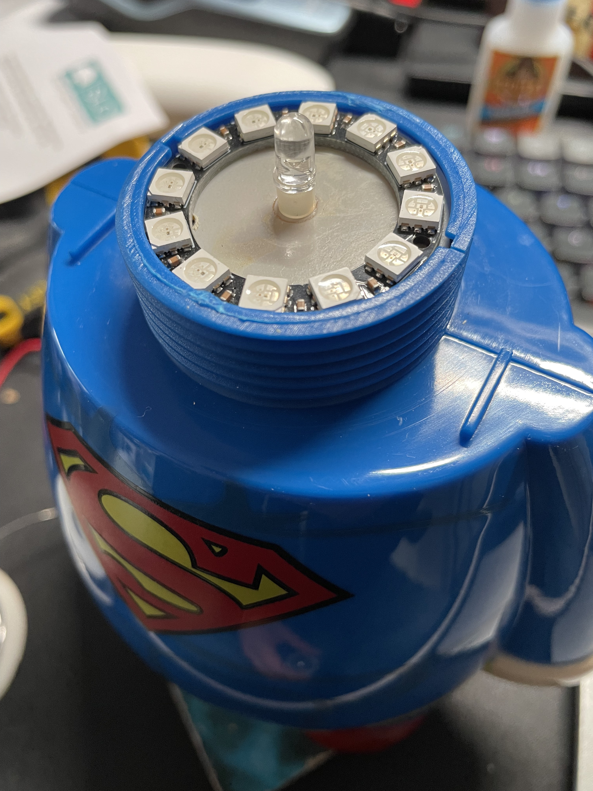

## Overview

My partner gifted me a Darth Vader Look-ALite lamp a few years back.  It looks awesome, and as a gift it's great!  A lamp themed after your favourite characters that's battery or USB powered?  Super cool.  

Until you use it, and realise it's a __SINGLE__ white LED in there.  It's basically useless as a lamp.  In fairness to the company behind it, if you read their website and packaging _carefully_ it never really suggests it could be used like a normal lamp and suggests it's more a decorative thing, but still.

I wanted to upgrade it.  So I took it apart and started taking some measurements and making some plans.

## The Plan

My plan was to fit a ring of addressable RGB LEDs inside the top of the lamp, that would connect to a ESP8266 or similar board to be controllable by Home-Assistant, and in our case therefore HomeKit & Siri.

## Components

- ESP8266 based micro-controller board ([NodeMCU](https://www.amazon.co.uk/s?k=nodemcu&crid=1RS4EJBBLF5OU&sprefix=nodemcu%2Caps%2C111&ref=nb_sb_noss_1) or similar)
- RGB LED ring (12x LEDs)
- Female-to-Female Jump Wire (Sometimes refered to as "Dupont Wire")


## Wiring

I opened up the light and drilled a couple of holes for the wires to pull through.


Then I de-soldered the power cables that come from the USB connector/switch and soldered some female jumper wire (Dupont) connectors onto them.  I could then plug this into the __"VIN"__ and __"GND"__ pins on the NodeMCU.  I used some heat shrink to protect the connections between the two kinds of cables.

I then soldered some jumper wire into the __"PWR"__, __"GND"__ and __"IN"__ connectors on the RGB LED ring.  These then connect to __"3.3v"__, __"GND"__ and __"D4"__ on the NodeMCU.


I then put a couple of blobs of super glue onto the bottom of the RGB ring, and put it on top of the original LED plate.  This probably isn't necessary as it will be "clamped" in somewhat once you screw the top on, but I thought it was worth it.



Now you're done and you can move onto the software.


## ESPHome Code

Using [ESPHome](https://esphome.io/) you can easily create the firmware for this light and update it wirelessly if you ever need to.

You'll need an install of [Home-Assistant](https://home-assistant.io/) too ideally.

Take a look at the code below and make sure you add secrets in ESPHome for your WiFi SSID _(`!secret wifi_ssid`)_ and password _(`!secret wifi_password`)_.

```
esphome:
  name: superman

esp8266:
  board: nodemcuv2

# Enable logging/Home Assistant API/OTA Updates
logger:
api:
ota:
  password: "GeneratedAutomaticallyByESPHome"

wifi:
  ssid: !secret wifi_ssid
  password: !secret wifi_password

  # Enable fallback hotspot (captive portal) in case wifi connection fails
  ap:
    ssid: "Superman Fallback Hotspot"
    password: "GeneratedAutomaticallyByESPHome"

captive_portal:

# LED Ring
# Using Pin D4 for connectivity to the LED ring
light:
  - platform: neopixelbus
    type: GRB
    variant: WS2811
    pin: D4
    num_leds: 12
    name: "Superman"
```

## Home-Assistant and Apple HomeKit

Once you've uploaded your code the NodeMCU, Home-Assistant should detect the device and offer to set it up for you.  Go through this process and you should then get the controls on the entity:


Then if you add it to your HomeKit configuration in Home-Assistant, it will be available to your Apple HomeKit devices too:


## Considerations

### Power

Powering off the 3.3v rail on the NodeMCU is not a great idea, but really the LEDs are so low power that this isn't really a concern for me.  Try it at your own risk!  But consider wiring the LEDs directly to 5v from the power input if you are using any different LEDs.