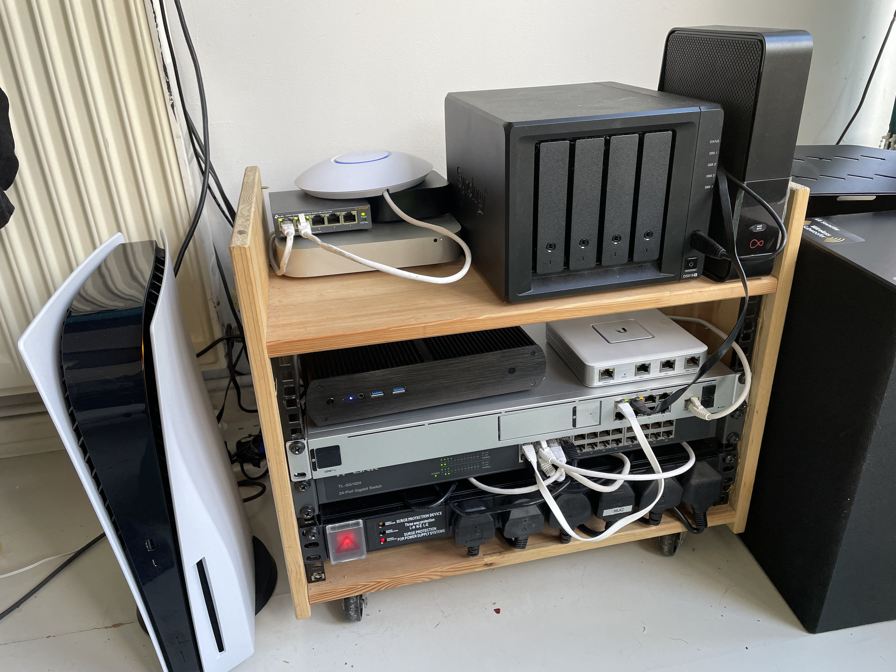

# Building my new HomeLab
## HomeLab

For many years now, I've run a 'server' at home in various incarnations: Mac minis, old PCs etc.  In the past few years where I've taken self-hosting services at home a lot more seriously, it's turned much more into a "HomeLab".  However, I'm definitely no networking expert, and my setup gets much more tweaking on the infrastructure and software side of things!

---

## Rack case

For many years I've had different rack setups for my HomeLab setup.  Even when most of it wasn't actually 19" rack mounted, it was just so much neater to have it on a rack shelf.

A few years back when I moved house I wanted to hide it all in a cupboard, but didn't have a huge amount of gear at the time (a Mac mini, Drobo, AirPort Extreme and a network switch I think), so I looked for a small rack that I could have, ideally on casters.

Everything was _SO_ expensive for me at the time, so I ended up making something out of a cheap Ikea bedside table that cost something like £8, then bought some rack "ears" and caster wheels from eBay.  This actually ended up being my solution even until I moved recently, as in my previous house it was sitting in the loft, so I saw no need for anything even vaguely sexy!  Here's a photo of it in it's final state, before it was replaced:

Since moving, we have a nice small garage space that makes sense to move this gear to, so it's out of the way.  I decided to buy a rack that I could wall mount, to maximise the floor space in there.  I found a 9U from a company on eBay for about £80.

The instructions it came with were... six diagrams.  Six badly drawn diagrams.  I wasn't expecting to have to use the instructions to be honest (after all, it's a metal box that gets screwed together and then screws to the wall!) but there were some strange brackets it came with that I couldn't for the life of me figure out what I was supposed to do with.  I ended up calling the company and the guy actually also didn't know, but at least was nice about it and honest!

I was worried about the installation of the back panel into the brickwork in the garage, but after buying some hetfy coach-bolts I managed to get the back plate onto the wall:

>You'll notice some _'ooze'_ from that top-right bolt.  I'm not sure whether I hit an air pocket or something in that brick, but I drilled with three increasingly large drill bits to try and keep things clean and when I got to the largest one, the brick just turned to cheese and crumbled apart.  I decided to just get the wall plug in place, and use some expanding glue compound to try and hopefully keep it in place.  I left this to dry overnight and it actually worked really well.  I came back the next day and I could screw in the coach bolt absolutely fine.

Here's a photo of the main part of the case assembled:

---

## Hardware 

### UniFi Dream Machine Pro

[Website: Dream Machine Pro](https://store.ui.com/collections/unifi-network-unifi-os-consoles/products/udm-pro)

Yes, I'm aware this is overkill.  I've had a bunch of UniFi products over the last few years (AP Lite, WiFi 6 APs and the USG3) and _really_ liked their approach to things.  I decided when we were moving house that as a bit of a treat to myself, I would factor the cost of buying a UDM Pro into the cost of moving.  This would allow me to replace my USG3 but also decommission my UniFi controller Docker container.  So far I'm super impressed.  _It just works_ and the speed of the interface is great.  I'm planning to try and utilise the NVR capabilities of it at some point too.

### Mac mini

This was my old media server for many years.  I bought it in 2011 and it was plugged into my [Drobo](https://drobo.com) at the time, serving media using Plex.  I got to the point where the bottleneck for my media consumption issues was the Firewire interface on my Drobo. As this Mac mini didn't have USB3, I could only utilise the Thunderbolt port to get a faster interface, but Thunderbolt or even USB3 Drobos at the time were _£££_ and it actually made sense to replace it all with a NAS instead.
Since then, it's become my primary [Proxmox](https://proxmox.com/) host where I run VMs and containers for a lot of my self-hosted services.

### Synology DS918+

I purchased this Synology from someone on Reddit (what a world we live in!) for just under £400.  It has been fantastic and has managed to replace my previous janky Mac mini and Drobo setup.  I've even used the brilliant Docker implementation in it to self host things like Plex and other services.

### Intel NUC

_(This is the black box with the blue light in the image)._  I bought this NUC specifically for my [Home-Assistant](https://home-assistant.io) setup.  I was previously running Home-Assistant on a Raspberry Pi, then a NUC using Ubuntu Server.  However the previous NUC (which I'd bought for another project originally) had no ethernet port, so I was utilising a USB to Ethernet dongle for connectivity.  This worked fine under Ubuntu Server which I was running Home-Assistant on previously, but I couldn't get it working under Home-Assistant OS. So I picked this NUC up off eBay for about £130, which included an SSD, RAM and WiFi card.

### TP-Link 24-Port Switch

This is a simple one.   I've had this for many years, and it's been super solid.  At the time I couldn't afford a managed switch and right now I'm not sure I could really even justify one!