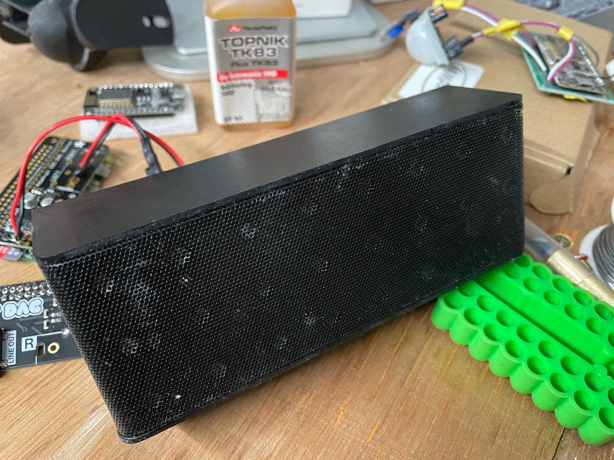

# Lullaby & White Noise Player

## Overview
Before our daughter was born, I was already thinking of all kinds of ways I could use home automation, and spefifically [Home Assistant](https://www.home-assistant.io) to help us with her daily routines.  One of the things I wanted to do was have a way of controlling audio in her room for things like bedtime stories, lullabies and white noise etc.  

---

## Goal
>
> To be able to say, *"Hey Siri, Isabella's bedtime,"* to trigger a sequence of lullabies followed by a nights worth of white noise.

I first attempted this using the Alexa Media Player components in [Home Assistant](https://www.home-assistant.io), but found that there were just too many things that didn't work quite the way I wanted.  Plus, being an iOS-first household, it made sense for it to be integrated with HomeKit and Siri.

I therefore decided to build my own solution.  I decided to go with a [Raspberry Pi](https://www.raspberrypi.org) and the [Volumio](https://volumio.org) software as I had used it before.

For the speaker itself, I had an old, cheap *(£10!)* Bluetooth hanging around that died.  The speakers themselves were fine, just the battery and audio board were both dead.  I removed both of them and the buttons and ports from the case as they weren't needed anymore.  I sealed up the insides of these holes with some tape and then filled in the gaps with some modelling filler ('Revell Plasto Body Putty' I think?) that I had lying around.  I sanded this down roughly and then gave the whole thing a quick spray with black spraypaint.  I *could* have put an actual USB-C/micro-USB port on the side of the case, but I would need to unplug it so infrequently, that I decided to opt to just drill a hole in the side of the case for a micro-USB cable to go through to connect directly to the [Raspberry Pi](https://www.raspberrypi.org).

---


## Components

#### Hardware
- [Raspberry Pi Zero W](https://www.raspberrypi.org/products/raspberry-pi-zero-w/)
- [Pimoroni pHAT DAC](https://shop.pimoroni.com/products/phat-dac)
- [Adafruit Audio Amplifier](https://www.adafruit.com/product/2130)

#### Software
- [Volumio](https://volumio.org)

---

## Setup
### Raspberry Pi

I flashed [Volumio](https://volumio.org) to the microSD card and set it up, connecting it to our WiFi network and configuring the [Pimoroni pHAT DAC](https://shop.pimoroni.com/products/phat-dac) in [Volumio](https://volumio.org).

I mounted the [Raspberry Pi](https://www.raspberrypi.org) over the network via SMB, and copied some lullabies and white noise loops to it.  I then set them up in a playlist in [Volumio](https://volumio.org).

I looked through the [Volumio API documentation](https://volumio.github.io/docs/API/API_Overview.html) and found out how to trigger Volumio to start playing a specific playlist via a CURL command:

```
curl -X GET 'http://192.168.1.200/api/v1/commands/?cmd=playplaylist&name=playlistName'
```
(Replace **192.168.1.200** with the IP address if your Volumio instance and **playlistName** with the name of the playlist you want to play.)

<br>

### Home-Assistant
Here's how the [command line switch entity](https://www.home-assistant.io/integrations/switch.command_line/) is setup inside [Home Assistant](https://www.home-assistant.io):

```
platform: command_line
switches:
  lullaby_bedtime_routine_switch:
    friendly_name: Lullaby Bedtime Routine
    command_on: !secret lullaby_on
    command_off: !secret lullaby_off
    command_state: !secret lullaby_status
    value_template: "{{ value_json.status == 'play' }}"
```

The **secrets** in this switch entity refer to the following CURL commands to the Volumio API.  These are laid out in `secrets.yaml`:

```
# Lullay Bedtime Routine
lullaby_status: "curl -X GET 'http://192.168.1.200/api/v1/getstate'"
lullaby_on: "curl -X GET 'http://192.168.1.200/api/v1/commands/?cmd=playplaylist&name=Bedtime'"
lullaby_off: "curl -X GET 'http://192.168.1.200/api/v1/commands/?cmd=pause'"
```