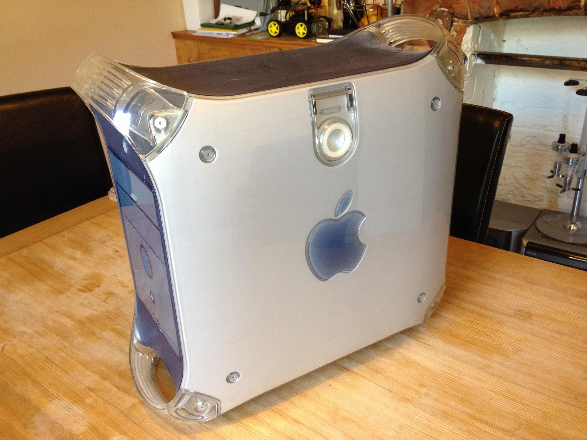
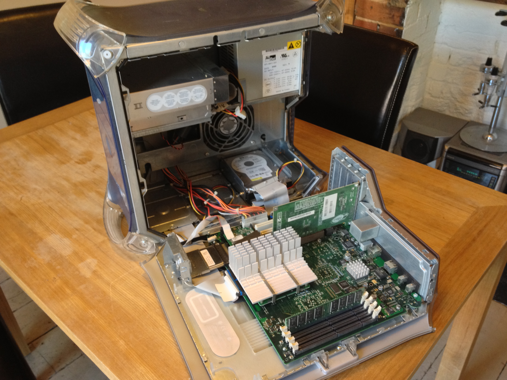

So, this old girl had definitely her day. 400MHz, 256MB RAM, 56K Modem… she had it all. However, these days she’s long past her usefulness. It’s time to give her a bit of a make over and one day a labotomy… So let’s open her up!

I am still a huge fan of this design. The motherboard mounted on the door is GREAT in my opinion, no matter what anyone says. However, all of this has to go!

IMG_0930

IMG_0931

IMG_0933

IMG_0936

IMG_0939

IMG_0942
The motherboard stand-offs required a 7mm wrench to get off. Why is the size you want always the last one you can find?

IMG_0944
So after a lot of playing about, the Logic Board came out. Next on to removing the side panels.

IMG_0946
This is the inside of the front panel board. I will need to break some connections on this board and solder wires directly onto this to use the buttons and LED’s etc.

IMG_0948
Innards out – time to paint some plastics!

IMG_0950
I decided to go with these Plasti-kote paints I got from B&Q. I thought about using a primer, but they said they would go straight onto plastic, so I thought I’d give it a try! Worst case scenario I need to do a bit of sanding and spray another coat or two!

IMG_0951

IMG_0954

IMG_0956

IMG_0958

IMG_0960

IMG_0962

IMG_0964

IMG_0966

IMG_0967

I’ve now sprayed up all the parts and have given them about three/four coats each with about three-four hours between each to dry. I covered up some of the parts I didn’t want to get paint on, like the Apple logo on the front panel (LED anyone?) with some Blutak before painting.

One of the alan-key screw heads that gets the handles off was threaded and wouldn’t come out, so I had to get creative with some plastic bags and masking tape to just paint that handle! But everything has gone pretty well so far!

Next step is to put it all back together once dry and see what it looks like! Then to contact the very helpful David from The Laser Hive to get the back part custom made for a new Motherboard.

---

**Update:  2nd June, 2013**

20130602-092929.jpg

So, most of the initial painting has gone really well.  There are some rough edges that I will be cleaning up today with some wet and dry and repainting, but other than that, I’m pretty pleased with how it turned out!

Here’s a partially re-assembled picture:

PowerMac G4 Paint Job

Next step is to do some finishing touches to the paint work and decide if it needs finishing with some kind of sealant / varnish or not.  The paint actually has this pretty nice ‘satin’ feel to it, so I think if I can get the wet and dry technique down, I might not have to!

---

**Update:  3rd June, 2013**

Image

Some more paint work done to my PowerMac G4 Mod…  The paint work isnt perfect, but I’m happy with it for now!  I ordered the two kits from The Laser Hive that convert the back section to be able to take normal motherboards!  Really looking forward to them turning up!

---

**Update:  4th July, 2013**

So!  I’m ALMOST finished!  With the help (again) from the excellent LaserHive who created the custom acrylic and metal parts for the mod, I have almost completed everything.

IMG_0060

After popping the back section off (which is harder than you may think!)  I had to do some cutting of the original case to get some things to fit.

IMG_0073David from The Laser Hive recommended a Dremel tool or similar, but I would go further to say that you need a REALLY GOOD Dremel blade to cut this.  The above picture shows my blades feeble attempts before it died a horrible death.  I figured I could buy a better blade, but I thought a hacksaw would be more useful to me in the long run, especially with the BoomBox mod that I’m currently working on.

IMG_0075

A trip to Clas Ohlson later, and I ended up with this bad boy!  £4 and it did the job really easily!

IMG_0080

Upon drilling out all the rivets and putting the new parts in place (which are great by the way – did I say how great they were?)  It was clear that something was up.  The above picture is me trying to shut the door.  Some parts of the metal casing were getting stuck against my new IO shield.

IMG_0087
IMG_0093

Some emails back and forth to David and some investigation later, I found the issue- two corners of the metal, and one edge needed some trimming to get them to fit.  Hacksaw time again!  This was very straightforward, and worked really well.  Once I worked out the fix, dropped David an email and he’s going to incorporate it going forward.  Great stuff!

IMG_0084

This is the back of the mod without the screws in – just testing how things line up – looking good!

IMG_0096

Metal parts now fitting after the trimming above.

IMG_0062

Time to drill the holes for the motherboard stand-offs.  I made the decision to cut off the old stand-offs that were in the way of the guide provided by David.  This made it much easier and I would definitely recommend this first, as I wasn’t sure.  Once these were drilled, it was a simple case of screwing in the new stand-offs.

IMG_0098

And here’s my Mini-ITX board fitted and working!  Not the board I will be using for the machine, but worked great!

Now to find a computer to go inside this beast!