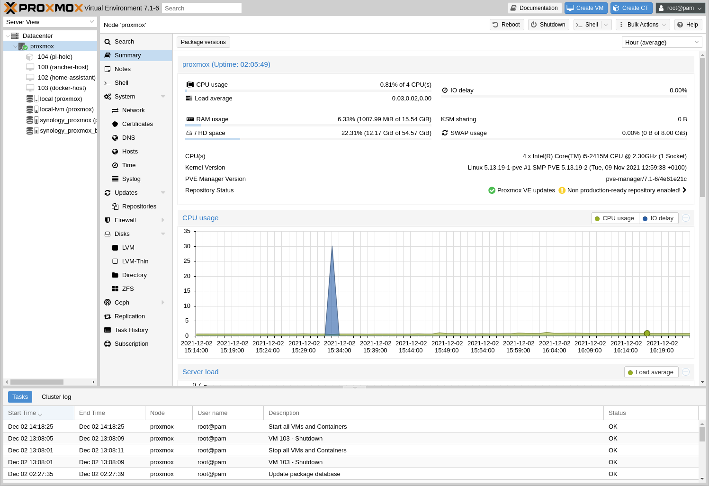

# Updating Proxmox VE
> NOTE:  At the time of writing I am using Proxmox VE 6.x  
> These instructions may no longer apply to future versions of Proxmox!
> Check the [Proxmox documentation](https://pve.proxmox.com/pve-docs/index.html) out before you try this!

&nbsp;

## Overview


These instructions are really for my own use (to prompt my terrible memory!) but allow you to update the base OS of Proxmox.

---

## Steps

- SSH to your Proxmox VE host.

- Add the following to `/etc/apt/sources.list`:

```
# Debian
deb http://ftp.uk.debian.org/debian buster-updates main contrib
deb http://ftp.uk.debian.org/debian buster main contrib

# Security
deb http://security.debian.org buster/updates main contrib

# Proxmox
deb http://download.proxmox.com/debian buster pve-no-subscription
```


> Note that you _might_ want to change the `uk` in the Debian.org URLs above.

- Run the following:  
`apt update`  
`apt dist-upgrade`

&nbsp;