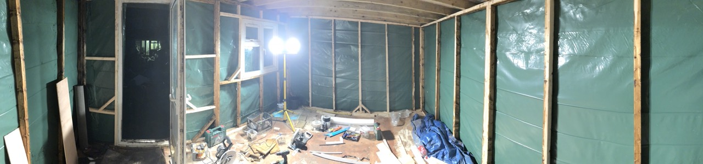
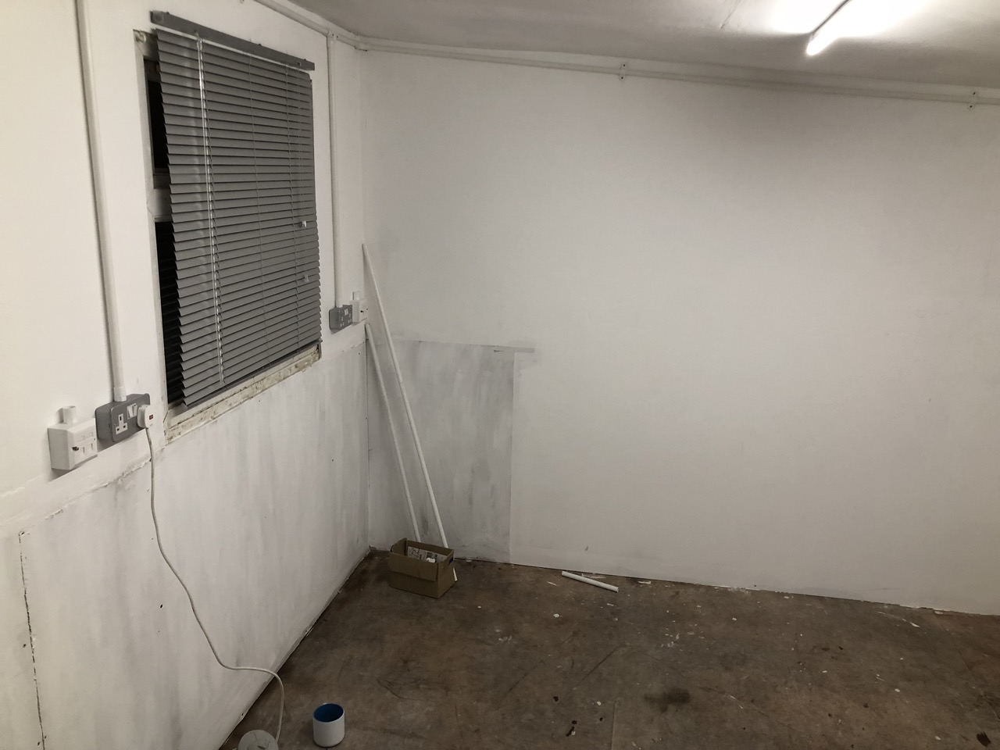

# Building our shed/workshop

## Overview

I was originally going to post this a long while back, but (call me a tinfoil-hat-wearer all you like) I was a bit skeptical of posting images of my house on the open-open interwebs.

However, now we're moving house I don't mind so much!  Also, it might be interesting if the new owners ever find this. **Hello new owners if you are reading this! 👋🏻** 

I've wanted to have a 'workshop' type space for a long time.  When we moved into our first house, I was using the spare room to do these in, which wasn't great when people came to stay... and then with our daughter on the way, having somewhere where I could try out new ideas without messing up the house got more important.

---

## The Plan

The end of our garden was very overgrown when we bought it, and there was a very *VERY* large (16ft) greenhouse, which we just didn't need.

The plan was to clear this space, remove the greenhouse and build a shed/workshop in it's place.

I put together some rough plans on Sketchup.  I don't have these anymore, but here's the almost-final one:

---

## The build

### Making Space

There was a lot of groundwork to be done.  There was a small concrete pathway that followed part of the raised bed at the back of the garden, and numbers chunks of concrete and brick in the ground around the place from obviously previously removed projects.  The greenhouse also had a huge, base of at least 3-layers deep of brick sunk into the ground as foundation around it's perimiter.  Serious stuff.

We cleared out a lot of the overgrown plants, and someone bought the greenhouse from us for almost nothing, with the understanding they had to dismantle and remove it themselves.  We were left with this:

After a LOT of back breaking effort with an SDS drill, we removed as much brickwork from the soil as we could, and halved the size of the raised bed to the right, dumping the soil in the remaining beds to make them higher.  We then built some retaining walls from wood.

We were getting somewhere, but the garden was a state.

After a lot of cleanup of the space, it was a fair bit clearer:

&nbsp;

### The base

As much brick and rubble as we cleared out of the soil, we were finding more.  It was becoming clear it was not going to be straightforward to clear - we would need a digger if we wanted to do it properly.  And with no access to the rear of the property like that, it meant that a concrete base was out of the question too. 

So I decided to create a raised base, almost like decking.  The idea being there would be space for airflow underneath, and it wouldn't be sitting direcly on the ground either.  And in the eventuality that someone wanted to remove it in years to come, after the top part of the building was dismantled, there would be minimal impact to the ground below.

So I came up with a design in Sketchup:

We would build a frame, supported by 9 thick (200mm) fence posts, sunk into the ground.  We marked out the space, and began digging the holes, sinking the fence posts in with concrete.

The cross-beams were tied together using at least two big, thick coach bolts at every joint.

Once the main, outer frame was in place and painted, we laid down some weed membrane underneath and began adding the cross-peices, which were hung with joist hangers, and then the "noggins" in between were just screwed in.

We wanted to fill in the gaps and keep the weed membrane in place, so we used some bricks that were left over and put them under the shed.  (This saved a trip to the dump too!).  And with that the base was complete.

Next, we laid down some membrane (which was a mistake, I'll cover that later in this post) with the idea that it would stop water coming up into the building and floor.  On top of this we laid some insulation.

Once the insulation was down, we *then* laid the floor on top, and started to screw it down.  The floor was 20mm thick "marine" ply.  I say "marine" as I later found out... it wasn't.  But we'll get to that later.

Obviously, as soon as you finish putting down your lovely new wood flooring... the heavens open.  So we stopped work that day and spent the evening covering it up with plastic sheeting to protect it!

We then took delivery of the wood we needed for the building frame, and with the help of my Dad's big car, managed to pickup a set of UPVC windows and a door from someone off Gumtree for £50.  We didn't need all of them, but had the intention of trying to resell the others for someone else to use in a project.  This never happened sadly and they ended up getting recycled.

&nbsp;

### The walls

We then started building the frame for the sides of the building.  We laid out the peices as per my sketchup printouts and cut them accordingly.

With the help of my Dad I was able to get these sides up and braced in one day.

&nbsp;

### The roof

The next day we moved onto fitting the door and window (which would also help to add some rigidity).

We next covered the roof with OSB.  Since the day came to an end quite quickly, we worked to cover the building in some plastic sheeting to protect it in case of rain.  We ended up keeping the green sheeting under the cladding as a layer of protection.

Now that it was wrapped like this, it really started to feel like a building on the inside.

I didn't get any pictures of the next part, but we then laid down a flat felt roof.  This was a tough and messy process, and I managed to mess up and make a couple of rips when adjusting which had to be rectified, but all in all I think it came out okay.  (You will see the results in pictures in the next section.)

&nbsp;

### Cladding

I bought some feather edge board to use as cladding (see "Things I would do differently next time" below!).  To make it easier to have a consistant spacing of the boards vertically, I built myself a little jig from some leftover battons.  It's not pretty or clever, but it worked!

I continued to clad up the side of the building on each side.  One thing I did which isn't really the _right_ way to do things is that I had a straight edge down the center where the boards met.  This really should have been staggered, but this came about because of the amount of material I had left.  Since I didn't want to really have to buy any more, I did this on as few sides as I could and made it look as neat as possible, to fill in later.

I borrowed an electric nail gun and this REALLY sped up the process.

With the cladding mostly done it was time to start work on the inside.

&nbsp;

### Insulation

For insulation we used Rockwool acoustic insulation.  This wasn't an intentional thing (I was planning on doing music in there!) it was just what was available at a good price at the time!

We cut the insulation and stuffed it tight into all of the holes between the noggins.  Unfortunately we had quite a few areas where the distance between the noggins wasn't a consistant size, so we had to use multiple peices to fill the widths which was tricky!

I also added a layer of this foil wrap insulation that I had left over in the roof.  NO clue whether this was actually a good idea or not - at the time we were just making things up as we went along!  

&nbsp;

### Boarding

Putting boards up on the ceiling was traumatic - a real relationship test!  In the end I ordered a tool from Amazon to hold the boards up - SO worth it.

We then moved on to boarding the inside.  I chose to go with plasterboard as it was easy to work with and could give a decent finish.  To keep costs down and as this was going to be a shed and most of the walls would be covered with tools or storage anyway, I decided not to skim or plaster over the top and instead just a couple of coats of hard wearing paint after jointing and sanding the boards.

The jointing wasnt perfect (as with everything on this build!)  But it looked decent enough for my eyes!

I then painted everywhere with at least two coats.  It turned out pretty good!

### Workbench and storage from scraps

Using some leftover flooring plywood and some other scraps, I built a nice long workbench just under the window at waist height.  My idea was that it would be nice to have something to stand up and work at and that I could then get a high chair/stool to go under it.  My good friend Andy provided me with some shelving he had left over too, so I threw this underneith.  Some was even left over to build some more storage on th opposite wall.

&nbsp;

### Electrics

I then started work on the electric hookup.  As you'll see from some of the other photos, I ran some conduit on the walls early on (as soon as the painting was done).  I made the decision to keep the electrics on TOP of the walls rather than running the cables through the walls as I wasn't 100% I trusted my walls and also it meant either myself or a qualified electrician could make changes easily as needed.

We hired an electrician to hookup all the switches and lights and also run an armoured cable down to the shed from the consumer unit in the conservatory of the main house.  It was really great to have proper power in there and seeing it lit up at night for the first time was awesome.

&nbsp;

### Networking

As soon as I had power in there I started work on running networking (because of course I did!)  I ran some outdoor rated ethernet down from the main house and into the shed.  I terminated it to a socket on the wall.

I then built a make-shift rack out of some materials I had left hanging around and mounted a UniFi WiFi access point and a small ethernet switch to it.

&nbsp;

### Vinyl flooring

I searched around online to find some cheap vinyl flooring as this would be easy to fit.  It wasn't easy as the dimensions of the room weren't very standard and made prices quite high.  I eventually got lucky and got an offcut for cheap from a website I found.

With the help of my Dad and a few cans of spray adhesive, we fit the floor down and it looked great! To tidy up the bottom edges, I bought some trim from B&Q to make a really tiny skirting.

&nbsp;

## The Finished Product

Overall the project was a LOT of hard work but it turned out so well.  It was invaluable to have a seperate office during the lockdowns of 2020 and beyond and it was so helpful to have a space to work on projects and DIY.  The floor space was actually big enough that we bought a normal garden shed to store things in, and I was able to build the base for it INSIDE the larger shed, sheltering from the rain! 

It kept nice and warm in the winter and on the late evenings or early mornings where it did get a bit colder, the small wall heater I bought was more than capable of bringing the temperature back up really quick.

We didn't keep detailed breakdowns of what we spent on it, but overall we beleive we spent ~£2500 on materials to build the whole thing.  That's great value.

&nbsp;

---

## Things I would do differently next time

### Cladding

We were on a budget when we built the shed, and tried to get materials for as cheap as possible.  The cladding was some very cheap, rough sawn stuff that you see on fences and cheap sheds.  It works fine, and once treated obviously keeps the weather out, but it does warp tremendously in temperature changes and in several places around the shed it warped so much that it popped the nail out that was holding it in, and I've had to subsequently screw them back in place.

I think if I were to do it again, I would spend the extra money on buying some nicer cladding that's pressure treated, or a nicer wood that's less susceptable to temperature changed and warping.  Maybe with a tounge & grouve setup.

---

### The Floor

In 2019 I started noticing that there was a 'spongy' part to the floor.  I knew this wasn't good news, but it didn't feel too bad so I hoped it was just a board that had come loose.  It didn't seem to get any better however, so eventually I had to make the tough decision to make a cut in the vinyl floor to find out what was going on.  I used a sharp blade and a rule and cut a small flap to take a look.  What I found was damp, wet floor.  Quite a big patch.  I eventually ripped up one side of the vinyl flooring and realised there were a couple of rather large patches.  Again, I knew this wasn't good news and that I would have to do something about it.

Knowing I'd have to replace the floor, I managed to get hold of some nice quality tongue and groove hardwood boards from a good friend and purchased some matching ones.  I decided to take no chances this time, so using up any remaining wood preserving paints and sealers, I painted up the boards as best as I could.

I then ripped up the vinyl flooring to find the extent of the damage.  Looking at what I'd done in creating the floor, I had made a mistake:  The sheeting that I put down to protect the building from rising moisture had acted like a bucket, collecting any water that managed to find it's way in.  This then got between the insulation and soaked into the floor boards.  Disaster.

My problem now was that my walls were resting on these boards.  I took a chance and decided to cut out the center of the flooring using a recipricating saw, leaving only the small sections around the edge that the walls were directly on top of.

Once I had cut it all out, I laid down the new boards.  This time directly onto the joists below.

I painted all the edges of the boards with some leftover fence/shed paint that is aquaphobic.  I then laid down some replacement vinyl flooring that I managed to again buy as an offcut.

I think I managed to save the floor in doing this, but I definitely learnt a lesson in the design of it!

&nbsp;