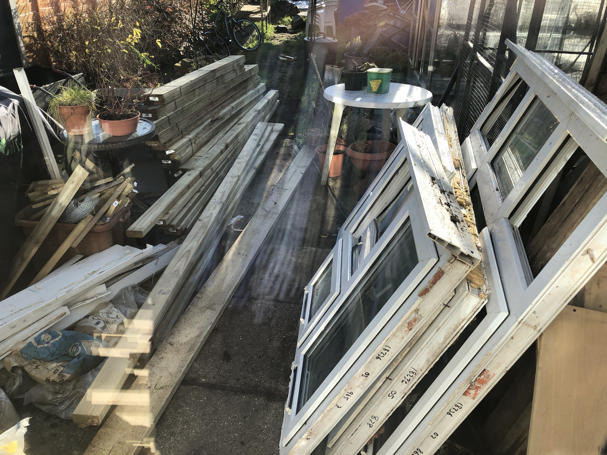

# Building our shed/workshop

## Overview

I was originally going to post this a long while back, but (call me a tinfoil-hat-wearer all you like) I was a bit skeptical of posting images of my house on the open-open interwebs.

However, now we're moving house I don't mind so much!  Also, it might be interesting if the new owners ever find this. **Hello new owners if you are reading this! 👋🏻** 

I've wanted to have a 'workshop' type space for a long time.  When we moved into our first house, I was using the spare room to do these in, which wasn't great when people came to stay... and then with our daughter on the way, having somewhere where I could try out new ideas without messing up the house got more important.

---

## The Plan

The end of our garden was very overgrown when we bought it, and there was a very *VERY* large (16ft) greenhouse, which we just didn't need.

The plan was to clear this space, remove the greenhouse and build a shed/workshop in it's place.

I put together some rough plans on Sketchup.  I don't have these anymore, but here's the almost-final one:

---

## Making Space

There was a lot of groundwork to be done.  There was a small concrete pathway that followed part of the raised bed at the back of the garden, and numbers chunks of concrete and brick in the ground around the place from obviously previously removed projects.  The greenhouse also had a huge, base of at least 3-layers deep of brick sunk into the ground as foundation around it's perimiter.  Serious stuff.

We cleared out a lot of the overgrown plants, and someone bought the greenhouse from us for almost nothing, with the understanding they had to dismantle and remove it themselves.  We were left with this:

After a LOT of back breaking effort with an SDS drill, we removed as much brickwork from the soil as we could, and halved the size of the raised bed to the right, dumping the soil in the remaining beds to make them higher.  We then built some retaining walls from wood.

We were getting somewhere, but the garden was a state.

After a lot of cleanup of the space, it was a fair bit clearer:

However, as much brick and rubble as we cleared out of the soil, we were finding more.  It was becoming clear it was not going to be straightforward to clear - we would need a digger if we wanted to do it properly.  And with no access to the rear of the property like that, it meant that a concrete base was out of the question too. 

So I decided to create a raised base, almost like decking.  The idea being there would be space for airflow underneath, and it wouldn't be sitting direcly on the ground either.  And in the eventuality that someone wanted to remove it in years to come, after the top part of the building was dismantled, there would be minimal impact to the ground below.

So I came up with a design in Sketchup:

We would build a frame, supported by 9 thick (200mm) fence posts, sunk into the ground.  We marked out the space, and began digging the holes, sinking the fence posts in with concrete.

The cross-beams were tied together using at least two big, thick coach bolts at every joint.

Once the main, outer frame was in place and painted, we laid down some weed membrane underneath and began adding the cross-peices, which were hung with joist hangers, and then the "noggins" in between were just screwed in.

We wanted to fill in the gaps and keep the weed membrane in place, so we used some bricks that were left over and put them under the shed.  (This saved a trip to the dump too!).  And with that the base was complete.

Next, we laid down some membrane (which was a mistake, I'll cover that later in this post) with the idea that it would stop water coming up into the building and floor.  On top of this we laid some insulation.

Once the insulation was down, we *then* laid the floor on top, and started to screw it down.  The floor was 20mm thick "marine" ply.  I say "marine" as I later found out... it wasn't.  But we'll get to that later.

Obviously, as soon as you finish putting down your lovely new wood flooring... the heavens open.  So we stopped work that day and spent the evening covering it up with plastic sheeting to protect it!

We then took delivery of the wood we needed for the building frame, and with the help of my Dad's big car, managed to pickup a set of UPVC windows and a door from someone off Gumtree for £50.  We didn't need all of them, but had the intention of trying to resell the others for someone else to use in a project.  This never happened sadly and they ended up getting recycled.

We then started building the frame for the sides of the building.  We laid out the peices as per my sketchup printouts and cut them accordingly.

---

## Things I would do differently next time

### Cladding

We were on a budget when we built the shed, and tried to get materials for as cheap as possible.  The cladding was some very cheap, rough sawn stuff that you see on fences and cheap sheds.  It works fine, and once treated obviously keeps the weather out, but it does warp tremendously in temperature changes and in several places around the shed it warped so much that it popped the nail out that was holding it in, and I've had to subsequently screw them back in place.

I think if I were to do it again, I would spend the extra money on buying some nicer cladding that's pressure treated, or a nicer wood that's less susceptable to temperature changed and warping.  Maybe with a tounge & grouve setup.

---

### The Floor

In 2019